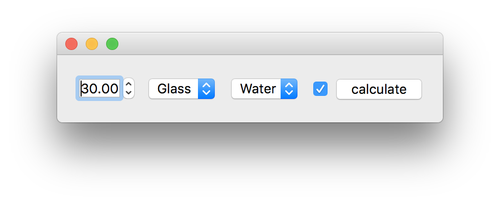

# magicgui 🧙

[](LICENSE)
[](https://pypi.python.org/pypi/magicgui)
[](https://python.org)

build GUIs from python functions, using magic.

## Installation

```shell
pip install magicgui
```

!!! note
    You will need to have a supported GUI backend also installed in your environment.
    Currently, the only supported backend is [Qt](https://www.qt.io/), via
    [qtpy](https://github.com/spyder-ide/qtpy) (but [open an
    issue](https://github.com/napari/magicgui/issues) if you would like to see a
    different backend supported).

    To use with Qt, you will also need to have either
    [PyQt5](https://pypi.org/project/PyQt5/) or
    [PySide2](https://pypi.org/project/PySide2/) installed in your environment. For
    example:

    ```shell
    pip install magicgui pyside2
    ```

## Introduction

The core feature of `magicgui` is the `@magicgui` decorator, which, when used to
decorate a function, will autogenerate a graphical user interface (GUI) by inspecting
the function signature and adding an appropriate GUI widget for each argument.  Argument
`types` are taken from [type hints](https://docs.python.org/3/library/typing.html) if
provided, or inferred using the type of the  default value.  The resulting GUI Class
is added to the function as a new attribute named `Gui`.

```python
import math
from enum import Enum
from magicgui import magicgui

# dropdown boxes are best made by creating an enum
class Medium(Enum):
    Glass = 1.520
    Oil = 1.515
    Water = 1.333
    Air = 1.0003

# decorate your function with the ``@magicgui`` decorator
@magicgui(call_button="calculate")
def snells_law(aoi=30.0, n1=Medium.Glass, n2=Medium.Water, degrees=True):
    aoi = math.radians(aoi) if degrees else aoi
    try:
        result = math.asin(n1.value * math.sin(aoi) / n2.value)
        return math.degrees(result) if degrees else result
    except ValueError:
        # beyond the critical angle
        return "Total internal reflection!"

# your function will have a new attribute "Gui"
# calling it instantiates the widget (and, optionally, shows it)
snell_gui = snells_law.Gui(show=True)
```

## et voilà

[](img/snells.png)

## two-way data binding

The fun is just beginning!  The new `snell_gui` object has attributes named after each of
the function parameters.  As you make changes in your new GUI, these attributes of the
`snell_gui` will be kept in sync.  For instance, change the first dropdown menu from
"Glass" to "Oil", and the corresponding parameter changes on `snell_gui`:

```python
In [2]: snell_gui.n1
Out[2]: <Medium.Oil: 1.515>
```

it goes both ways: change a parameter in the console and it will change in the GUI:

```python
In [3]: snell_gui.aoi = 47

In [4]: print(snell_gui)
<MagicGui: snells_law(aoi=47.0, n1=Medium.Glass, n2=Medium.Water, degrees=True)>
```

## calling the function

We can call our function in a few ways:

1. Because we provided the `call_button` argument to the `magicgui` decorator, a new
   button was created that will execute the function with the current gui parameters
   when clicked.  (*at the moment, we haven't hooked anything up to it, so it won't*
   *be all that interesting!*)

2. We can also directly call the original function. Now however, the current values from
   the GUI will be used as the default values for any arguments that are not explicitly
   provided to the function:

    ```python
    In [5]: snells_law()
    Out[5]: 56.22

    # Note: calling the gui object has the same result
    # as calling the original function:
    In [6]: snell_gui()
    Out[6]: 56.22
    ```

3. You can still override positional or keyword argumnets in the original function, just
   as you would with a regular function.  (Note: calling the function with values that
   differ from the GUI will *not* set the values in the GUI... It's just a one-time
   call).

    ```python
    # in radians, overriding the value for the second medium (n2)
    In [7]: snells_law(0.8, n2=Medium.Air, degrees=False)
    Out[7]: 'Total internal reflection!'
    ```

## connecting events

### function calls

Usually in a GUI you are looking for something to happen as a result of calling the
function.  The original function (and the gui instance) will have a new `called`
attribute (a Qt Signal) that you can connect to an arbitrary callback function:

```python
def my_callback(result):
    # do something with the result, trigger other events, etc...
    ...

snells_law.called.connect(my_callback)
```

Now when you call `snells_law()` or `snell_gui()`, or click the `calculate` button
in the gui, `my_callback` will be called with the result of the calculation.

### parameter changes

You can also listen for changes on individual function parameters by connecting to the
`<parameter>_changed` signal:

```python
# whenever the current value for n1 changes, print it to the console:
snell_gui.n1_changed.connect(print)
```

This signal will be emitted regardless of whether the parameter was changed in the GUI or
via by [directly setting the paramaeter on the gui instance](#two-way-data-binding).

```python
In [8]: snell_gui.n1 = Medium.Air
Medium.Air
```


## @optional

Remember, `@decorators` are just [syntactic
sugar](https://en.wikipedia.org/wiki/Syntactic_sugar): you don't have to use `magicgui`
to decorate your function declaration. You can also just [call it with your function as
an argument](https://realpython.com/lessons/syntactic-sugar/):

```python
# the decorator in the first example could be replaced with this:
magic_snell = magicgui(snells_law, call_button='calculate')
snell_gui = magic_snell.Gui(show=True)
```

## configuration and advanced usage

The `@magicgui` decorator takes a number of options that allow you to configure the GUI
and it's behavior.  See [configuration](configuration.md) for more information.
