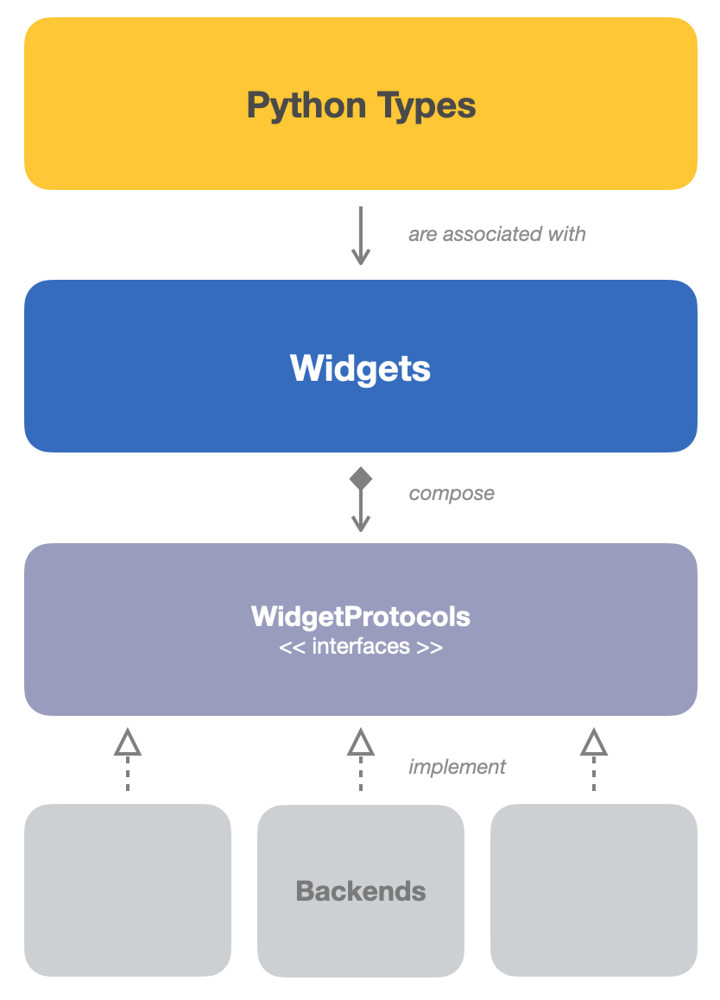

# magicgui 🧙

`magicgui` is a python library for building graphical user interfaces (GUIs).

It aims to speed up data workflows by providing a simple, consistent API for
creating GUIs to control various data types, that work across various
environments.

GUIs may be built manually using a variety of widgets, or generated
automatically from python [type hints](https://peps.python.org/pep-0484/).

## magicgui organization

**magicgui** can be thought of as performing two distinct tasks:

1. Providing an **simplified abstraction layer for GUI frameworks**, allowing you to
   use the same API to create UIs that can move between environments and
   frameworks (such as a desktop app, or a Jupyter notebook).
2. Providing a **mapping of python types to widgets**, allowing you to autogenerate
   graphical user interfaces for functions and dataclasses by annotating with
   standard python type hints.

While there is some degree of customizeability, the emphasis is on **rapid
development** of relatively simple GUIs, with **minimal boilerplate**.  For highly
customized GUIs with complex layouts, it may be more appropriate to use a
lower-level GUI framework.

The API is organized into 2 main levels:

<figure markdown>
  { width="350",loading=lazy }
  <figcaption>magicgui API layers</figcaption>
</figure>

### Python Type Mapping ## {: .rectHeading .yellowRect }

At its highest level, magicgui provides a **mapping of Python types to widgets**.
This API allows you to create graphical user interfaces for your functions and
dataclasses simply by annotating them with standard python
[type hints](https://peps.python.org/pep-0484/).

??? info "Type hints??"

    Type hints are a way to annotate your code with information about the types of
    variables and function arguments.  They are completely optional, but [static
    type checkers](http://mypy-lang.org) and other libraries (like **magicgui**!)
    can use them to check your code and/or provide additional functionality.

    Typically, they are provided after a colon following a variable name or
    function argument.

    *In the example below, `param_a` has been annotated as an `int`, `param_b` as a
    `str`, and the return value as a `list`.*

    ``` python
    def my_function(param_a: int, param_b: str) -> list:
        ...
    ```

    If you are new to type annotations in Python, here are a few resources to get
    you started:

    - [PEP 484](https://www.python.org/dev/peps/pep-0484/) - the Python Enhancement
    Proposal that introduced type hints to the language. (See also: [PEP
    483](https://www.python.org/dev/peps/pep-0483/))
    - [Python docs](https://docs.python.org/3/library/typing.html) - the official
    Python documentation on type hints and the `typing` module.
    - The [mypy documentation](https://mypy.readthedocs.io/en/stable/index.html)
    also has a lot of useful information, including [this cheat
    sheet](https://mypy.readthedocs.io/en/stable/cheat_sheet_py3.html)

#### `create_widget`

[`magicgui.widgets.create_widget`][magicgui.widgets.create_widget] is a general function, used throughout the library, that allows you to create a widget for a specific Python type or value:

```python
from magicgui.widgets import create_widget

# passing a type to create_widget
widget = create_widget(annotation=int)
widget.show()
```

```python
# passing a value to create_widget
widget2 = create_widget(value="Hello World")
widget2.show()
```

For more details on how magicgui maps types to widgets, see
[Type Mapping](type_map.md).

#### magicgui

The [`magicgui.magicgui`][magicgui.magicgui] function is one way to
autogenerate a compound Widget based on the parameters of a function:

```python
from typing import Annotated, Literal
# for Python <= 3.8
# from typing_extensions import Annotated
# for Python <= 3.7
# from typing_extensions import Annotated, Literal

from magicgui import magicgui


@magicgui
def my_function(
    param_a: int,
    param_b: Annotated[int, {'widget_type': "Slider", 'max': 100}] = 42,
    param_c: Literal["First", "Second", "Third"] = "Second"
):
    print("param_a:", param_a)
    print("param_b:", param_b)
    print("param_c:", param_c)

# my_function now IS a widget, in addition to being a callable function
my_function.show()
```

For more details on using `magicgui` and `magic_factory`, see the [magicgui
decorators](decorators.md) page.

#### :material-flask-outline: guiclass

[`magicgui.experimental.guiclass`][magicgui.experimental.guiclass] is a newer experimental feature that provides an object-oriented
alternative to `magicgui`.  It wraps [`dataclasses.dataclass`][dataclasses.dataclass] and adds a
`gui` attribute to the resulting class, which is a `magicgui`-generated widget
that can be used to control the dataclass instance.  (The widget is only created
when the `gui` attribute is accessed for the first time.)

```python
from magicgui.experimental import guiclass, button

@guiclass
class MyDataclass:
    a: int = 0
    b: str = 'hello'
    c: bool = True

    @button
    def compute(self):
        print(self.a, self.b, self.c)

obj = MyDataclass(a=10, b='foo')
obj.gui.show()
```

For more details on using the `guiclass` decorator, see [Dataclasses & guiclass](dataclasses.md).

### Widgets ## {: .rectHeading .blueRect }

At the lower level, magicgui is a **library of widgets** (the individual
elements that make up a graphical user interface). Each widget is customized to
display and interact with a specific type of data.  In some cases, it makes more
sense to create and arrange these widgets manually, rather than using the type-based
autogeneration features described above.

Magicgui acts as an **abstraction layer for a variety of different GUI
toolkits**, allowing you to use the same API to create UIs that can move between
environments (such as a desktop app, or a Jupyter notebook).

Currently, **magicgui** supports the following backends:

- [Qt](https://www.qt.io/) (via
  [PySide2](https://pypi.org/project/PySide2/)/[PySide6](https://pypi.org/project/PySide6/)
  or
  [PyQt5](https://pypi.org/project/PyQt5/)/[PyQt6](https://pypi.org/project/PyQt6/))
- [Jupyter Widgets](https://ipywidgets.readthedocs.io/en/latest/) (a.k.a.
  "IPyWidgets")

You can use `magicgui.widgets` to quickly build graphical user interfaces.

```python
from magicgui import widgets

a = widgets.SpinBox(value=10, label="a")
b = widgets.Slider(value=20, min=0, max=100, label="b")
result = widgets.LineEdit(value=a.value * b.value, label="result")
button = widgets.PushButton(text="multiply")

@button.clicked.connect
def on_button_click():
    result.value = a.value * b.value

container = widgets.Container(widgets=[a, b, result, button])
container.show()
```

To learn more about the available widgets and how to use them, see the
[Widgets Overview](widgets.md).

!!!info "...details"
    Behind the scenes, **magicgui** declares a set of [`WidgetProtocols`](api/protocols.md) that each
    backend must implement, and every magicgui `Widget` is a wrapper around a
    backend-specific widget.  Most users will never need to worry about this,
    but it's good to know that it's there if you ever need to dig deeper.

### Events

All widgets (whether created directly or autogenerated based on type hints)
emit events when their value changes or in response to interaction.

To learn about connecting custom functionality to these events,
see [Events](events.md).

## Installation

See [installing magicgui](installation.md).
