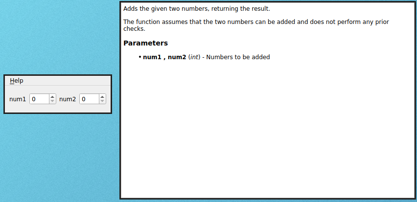

# Main Window Option

By default, when using the Qt backend, magicgui's window is a plain [QWidget](https://doc.qt.io/qt-5/qwidget.html), not a [QMainWindow](https://doc.qt.io/qt-5/qmainwindow.html) subclass. This allows the GUI to be easily integrated into other Qt applications, but it also means that the window lacks a few features such as the top app menu.

To enable that top app menu you should use the `main_window` flag when decorating your main function:

```python
from magicgui import magicgui

@magicgui(main_window=True)
def add(num1: int, num2: int) -> int:
    """
    Adds the given two numbers, returning the result.

    The function assumes that the two numbers can be added and does
    not perform any prior checks.

    Parameters
    ----------
    num1 , num2 : int
        Numbers to be added

    Returns
    -------
    int
        Resulting integer

    Examples
    --------
    ```
    add(2, 3)  # returns 5
    ```
    """
    return num1 + num2
```

Running this function will show a GUI with a top app menu bar containing a single entry - "Help", with a "Documentation" option. Clicking on it will pop up an HTML-enabled text box that shows the function's complete documentation:



This can be very helpful when your tool's functionality is not completely obvious at first glance, or when a few different user-enabled flags may interact in non-trivial ways. Alongside the tooltips for each parameter (which magicgui automatically generates) the GUI will be as well-documented as your code is.

A runnable example which uses the HTML capabilties of this feature can be found in the github repository at [examples/main_window.py](https://github.com/napari/magicgui/blob/master/examples/main_window.py).
